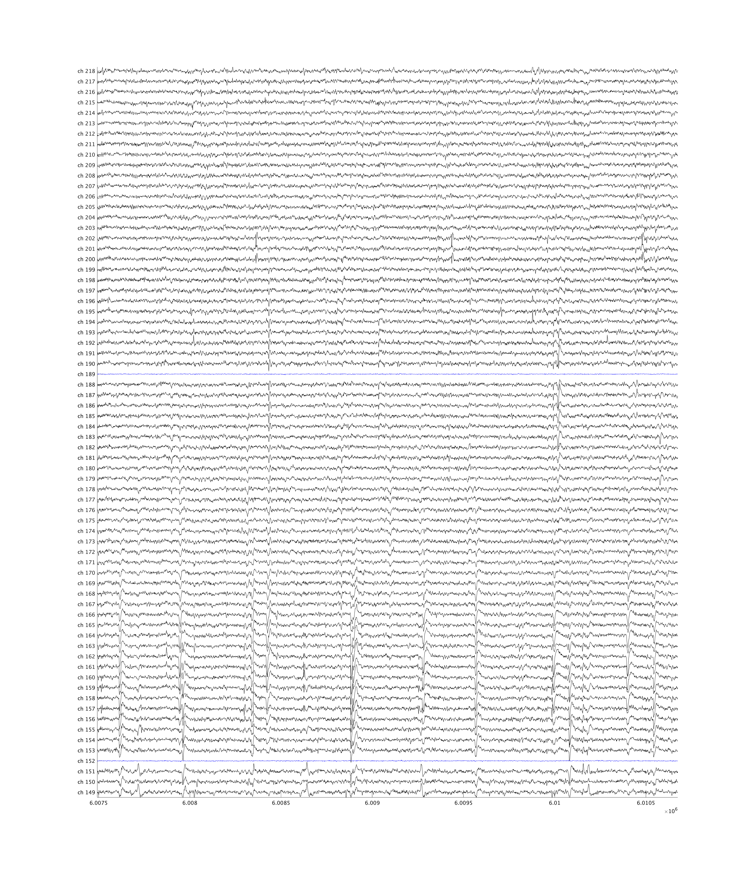
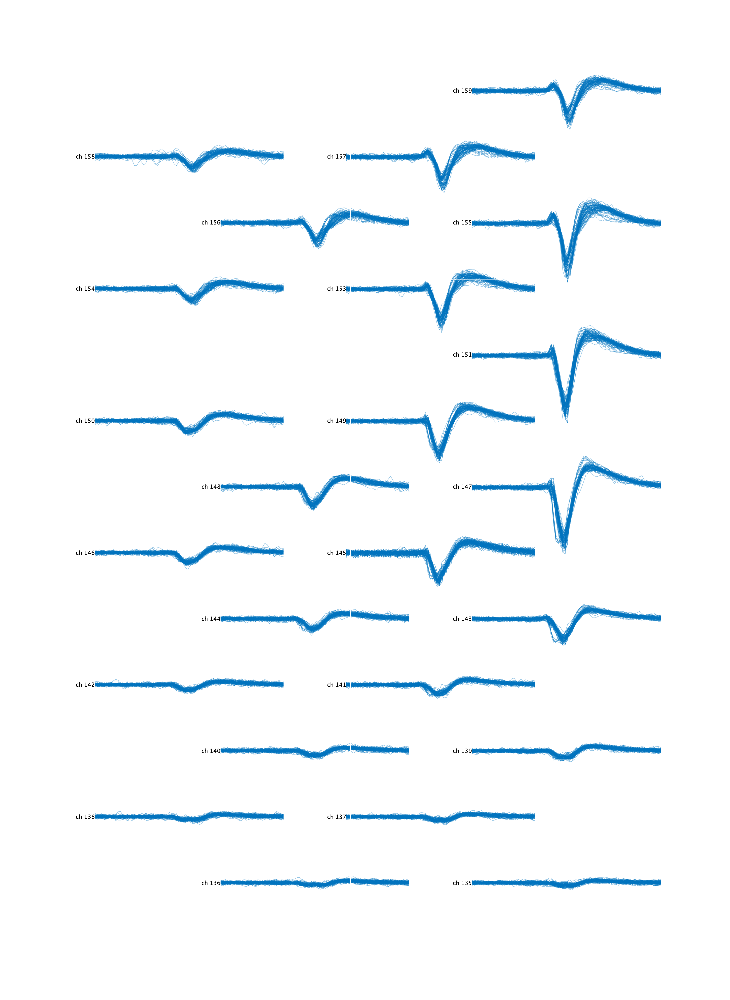

# MATLAB Neuropixel Utilites

Neuropixel Utils is a toolkit written in Matlab for manipulating datasets collected by [SpikeGLX](https://github.com/billkarsh/SpikeGLX) (e.g. `imec.ap.bin` files) and the results produced by [Kilosort](https://github.com/cortex-lab/KiloSort) / [Kilosort 2](https://github.com/MouseLand/Kilosort2/). Please note that some of this functionality is redundant with the tools found in the Cortex Lab's [spikes repository](https://github.com/cortex-lab/spikes), authored By Nick Steinmetz, Mush Okun, and others. Here, we prioritize an organized, easy to use, object-oriented approach to accessing, manipulating, and visualizing the data. This reduces the need to worry about metadata.

Neuropixel Utils facilitates the following data processing steps:

- [Load](imec_dataset.md#constructing-a-neuropixelimecdataset) and [visualize](imec_dataset.md#plotting-specific-time-windows) raw neuropixel data from `imec.ap.bin` and `imec.lf.bin` files in Matlab
- [Write custom pre-processing functions](imec_dataset.md#building-a-preprocessing-pipeline) to apply to raw data either by writing a copy of the raw file or modifying it in place, optionally removing specific problematic time windows in the file
- [Concatenate multiple Imec data files](imec_dataset.md#concatenating-multiple-files-together) together while matching the amplifier gains
- [Run Kilosort/Kilosort2](kilosort.md#running-kilosort), and [load the results](kilosort.md#loading-kilosort-results) back into Matlab after manual inspection in Phy
- [Plot drift maps](analysis.md#plotting-drift-maps) using code adapted from the [spikes repository](https://github.com/cortex-lab/spikes)
- [Extract waveforms](waveforms.md#extracting-waveforms-via-kilosortdataset) for each cluster from the raw data, optionally cleaning the snippets by subtracting templates for other clusters spiking during the same time window
- [Visualize cluster electrical spiking images](analysis.md#plotting-electrical-images) in space and [cluster locations on the probe](analysis.md#plotting-cluster-centers-of-mass)
- [Determine trial boundaries](kilosort.md#segmenting-a-kilosort-dataset-into-trials) in the file, and efficiently [segment Kilosort results into individual trials](kilosort.md#kilosorttrialsegmenteddataset)

Neuropixel Utils was authored by [Daniel J O'Shea](http://djoshea.com) ([@djoshea](https://twitter.com/djoshea)) to facilitate precision artifact removal and careful inspection of raw data traces before running Kilosort, as well as post-hoc verification that the artifacts were removed successfully.

## Download and install

To get started, clone the repo:
```bash
git clone https://github.com/djoshea/neuropixel-utils.git
```

And add it to your path in Matlab:
```matlab
>> addpath('/path/to/neuropixel-utils')
```

## Example walkthrough

```matlab
% Create an ImecDataset pointing at a specific
>> channelMapFile = 'neuropixPhase3A_kilosortChanMap.mat';
>> imec = Neuropixel.ImecDataset('/data/raw_datasets/neuropixel_01.imec.ap.bin', 'channelMap', channelMapFile);

ImecDataset with properties:

             pathRoot: '/data/raw_datasets'
             fileStem: 'neuropixel_01'
         creationTime: 7.3722e+05
            nChannels: 385
           fileTypeAP: 'ap'
           nSamplesAP: 112412208
           nSamplesLF: 0
                 fsAP: 30000
                 fsLF: NaN
     highPassFilterHz: 300
               apGain: 500
              apRange: [-0.6000 0.6000]
               lfGain: 250
              lfRange: [-0.6000 0.6000]
              adcBits: 10
           channelMap: [1×1 Neuropixel.ChannelMap]
     syncChannelIndex: 385
         syncInAPFile: 1
          badChannels: [3×1 double]
         syncBitNames: [16×1 string]
              syncRaw: []
       bytesPerSample: 2
                hasAP: 0
                hasLF: 0
       channelMapFile: '~/npl/neuropixel-utils/map_files/neuropixPhase3A_kilosortChanMap.mat'
       mappedChannels: [384×1 double]
      nChannelsMapped: 384
    connectedChannels: [374×1 double]
   nChannelsConnected: 374
         goodChannels: [371×1 double]
        nGoodChannels: 371
           channelIdx: [384×1 double]
         channelNames: [385×1 string]
   channelNamesPadded: [385×1 string]
            nSyncBits: 16
        syncBitsNamed: [0×1 double]
      creationTimeStr: '08-Jun-2018 12:09:07'
          apScaleToUv: 2.3438
          lfScaleToUv: 2.3438

% Mark individual channels as bad based on RMS voltage
>> rmsBadChannels = imec.markBadChannelsByRMS('rmsRange', [3 100]);

% Specify names for the individual bits in the sync channel
>> imec.setSyncBitNames([1 2 3], {'trialInfo', 'trialStart', 'stim'});

% Save the bad channels and Sync bit names to the .imec.ap.meta file so they are loaded next time
>> imec.writeModifiedAPMeta();

% Perform common average referencing on the file and save the results to a new location
>> cleanedPath = '/data/cleaned_datasets/neuropixel_01.imec.ap.bin';
>> extraMeta = struct();
>> extraMeta.commonAverageReferenced = true;
>> fnList = {@Neuropixel.DataProcessFn.commonAverageReference};
>> imec = imec.saveTranformedDataset(cleanedPath, 'transformAP', fnList, 'extraMeta', extraMeta);

% Sym link the cleaned dataset into a separate directory for Kilosort2
>> ksPath = '/data/kilosort/neuropixel_01.imec.ap.bin';
>> imec = imec.symLinkAPIntoDirectory(ksPath);

% Inspect the raw IMEC traces
>> imec.inspectAP_timeWindow([200 201]); % 200-201 seconds into the recording
```

Zoomed in view of data inspection figure. Black are good channels, blue are reference channels. Channels marked bad would be shown in red.



```matlab
% Run Kilosort2
>> Neuropixel.runKilosort2(imec);

% Load the Kilosort2 results
>> ks = Neuropixel.KilosortDataset();
>> ks.load()

KilosortDataset with properties:

                  path: '/data/kilosort/neuropixel_01'
           raw_dataset: [1×1 Neuropixel.ImecDataset]
            channelMap: [1×1 Neuropixel.ChannelMap]
                  fsAP: 30000
           apScaleToUv: 2.3438
                  meta: [1×1 struct]
              pathLeaf: 'neuropixel_01'
              isLoaded: 1
         hasRawDataset: 1
               nSpikes: 8181228
       nChannelsSorted: 371
             nClusters: 592
            nTemplates: 653
           nPCFeatures: 32
   nFeaturesPerChannel: 3
             nChannels: 371
          syncBitNames: [16×1 string]
              dat_path: 'neuropixel_01.imec.ap.bin'
        n_channels_dat: 385
                 dtype: 'int16'
                offset: 0
           sample_rate: 30000
           hp_filtered: 0
            amplitudes: [8181228×1 double]
           channel_ids: [371×1 uint32]
     channel_positions: [371×2 double]
           pc_features: [8181228×3×32 single]
        pc_feature_ind: [653×32 uint32]
     similar_templates: [653×653 single]
       spike_templates: [8181228×1 uint32]
           spike_times: [8181228×1 uint64]
     template_features: [8181228×32 single]
  template_feature_ind: [653×32 uint32]
             templates: [653×82×371 single]
         templates_ind: [653×371 double]
         whitening_mat: [371×371 double]
     whitening_mat_inv: [371×371 double]
        spike_clusters: [8181228×1 uint32]
        cluster_groups: [592×1 categorical]
           cluster_ids: [592×1 uint32]
         clusters_good: [210×1 uint32]
          clusters_mua: [58×1 uint32]
        clusters_noise: [322×1 uint32]
     clusters_unsorted: [2×1 uint32]

% Define how the data are segmented into trials (you implement this)
>> tsi = computeTrialSegmentation(imec)

  TrialSegmentationInfo with properties:

             fs: 30000
        trialId: [1072×1 uint32]
    conditionId: [1072×1 uint32]
       idxStart: [1072×1 uint64]
        idxStop: [1072×1 uint64]

% Segment the KilosortDataset into trials based on start and stop idx
% trial_ids are specified according to the data structure being merged into.
% If a trial is included in trial_ids but not found in tsi,
% its contents would be blank and trial_has_data(i) would be set false.
%
% Each of seg's properties are now nTrials x ... cells containing the data
% corresponding to that trial
>> trial_ids = min(tsi.trialId):max(tsi.trialId);
>> seg = Neuropixel.KilosortTrialSegmentedDataset(ks, tsi, trial_ids)

KilosortTrialSegmentedDataset with properties:

                   dataset: [1×1 Neuropixel.KilosortDataset]
                 trial_ids: [1072×1 uint32]
            trial_has_data: [1072×1 logical]
               trial_start: [1072×1 uint64]
                trial_stop: [1072×1 uint64]
                 spike_idx: {1072×592 cell}
               cluster_ids: [592×1 uint32]
            cluster_groups: [592×1 categorical]
                      sync: {1072×1 cell}
              syncBitNames: [16×1 string]
               raw_dataset: [1×1 Neuropixel.ImecDataset]
                   nTrials: 1072
           nTrialsHaveData: 1072
                 nClusters: 592
                 nChannels: 385
         trial_duration_ms: [1072×1 double]
                      fsAP: 30000
                amplitudes: {1072×592 cell}
               pc_features: {1072×592 cell}
               spike_times: {1072×592 cell}
  spike_times_ms_rel_start: {1072×592 cell}
         template_features: {1072×592 cell}
           spike_templates: {1072×592 cell}

% Compute useful stats about each template and cluster
>> metrics = ks.getMetrics()

KilosortMetrics with properties:

                         ks: [1×1 Neuropixel.KilosortDataset]
                         fs: 30000
                 channelMap: [1×1 Neuropixel.ChannelMap]
                channel_ids: [371×1 uint32]
         concatenatedStarts: 1
          concatenatedNames: {'neuropixel_01'}
               template_unw: [653×82×371 single]
            template_scaled: [653×82×371 single]
      template_centerOfMass: [653×2 single]
      template_is_localized: [653×1 logical]
          template_waveform: [653×82 single]
       template_waveform_ch: [653×1 uint32]
         template_amplitude: [653×1 single]
               template_ttp: [653×1 single]
     template_best_channels: [653×371 uint32]
                spike_times: [8181228×1 uint64]
            spike_amplitude: [8181228×1 single]
         spike_centerOfMass: [8181228×2 single]
            spike_templates: [8181228×1 uint32]
             spike_clusters: [8181228×1 uint32]
                cluster_ids: [592×1 uint32]
  cluster_template_mostUsed: [592×1 uint32]
      cluster_template_list: {592×1 cell}
  cluster_template_useCount: [592×653 uint64]
      cluster_num_templates: [592×1 uint32]
      cluster_best_channels: [592×371 uint32]
       cluster_centerOfMass: [592×2 single]
       cluster_is_localized: [592×1 logical]
           cluster_waveform: [592×82×11 single]
        cluster_waveform_ch: [592×592 uint32]
          cluster_amplitude: [592×1 single]
                cluster_ttp: [592×1 single]
                spike_depth: [8181228×1 single]
         spike_is_localized: [8181228×1 logical]
             cluster_depth: [592×1 single]

% Plot a drift map, annotated with trial start markers
>> metrics.plotDriftmap('tsi', tsi);
```


Note that the cluster structure looks distinct during a few time windows near the beginning and end of the recording, corresponding to regions when no trials were being performed (blue ticks near the bottom).

```matlab
% Extract raw waveforms for a specific cluster id at the 24 largest amplitude channels
% Clean these waveforms by subtracting the contribution of other clusters spiking within the same time window
>> ss = ks.getWaveformsFromRawData('cluster_id', 255, 'num_waveforms', 100, 'best_n_channels', 24,  'subtractOtherClusters', true)

SnippetSet with properties:

                    data: [24×82×100 int16]
             cluster_idx: [100×1 uint32]
  channel_idx_by_cluster: [24×1 uint32]
      unique_cluster_idx: 255
             sample_idx: [100×1 uint64]
               trial_idx: [0×1 uint32]
                  window: [-40 41]
                   valid: [100×1 logical]
             channelMap: [1×1 Neuropixel.ChannelMap]
               scaleToUv: 2.3438
                      fs: 30000
               nChannels: 24
             nTimepoints: 82
               nSnippets: 100
               nClusters: 1
             data_valid: [24×82×100 int16]
                 time_ms: [1×82 double]

% Plot these waveforms at their physical coordinates on the neuropixel
>> ss.plotAtProbeLocations()
```

